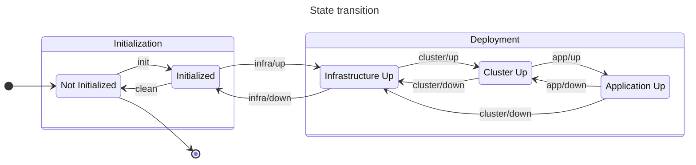

# K8s project template

> 🚨 **WARNING**: This project is under development. The code is unstable and the documentation is incomplete.

## Prerequisites

- Docker
- Docker Compose
- GNU Make

## Getting started



### Setup

```sh
$ make init # Initialize all configuration files.
$ make infra/up # Setup the infrastructure.
$ make infra/exec # Enter the shell of the main container.
[main@main k8s-project-template]$ make cluster/up # Setup the cluster.
[main@main k8s-project-template]$ make app/up # Setup the application.
[main@main k8s-project-template]$ make test/run # Run all tests.
```

### Teardown

```sh
[main@main k8s-project-template]$ make cluster/down # Teardown the cluster.
[main@main k8s-project-template]$ exit # Leave the shell of the main contaienr.
$ make infra/down # Teardown the infrastructure.
$ make clean # Remove most configuration files.
```

## `Makefile` targets

### Initialization

| Target      | Description                                                    |
| ----------- | -------------------------------------------------------------- |
| `init`      | Initialize all configuration files and empty data directories. |
| `clean`     | Remove all configuration files (leave data directories).       |
| `clean-all` | Remove all configuration files and data directories.           |

### Deployment

| Target         | Description                                          |
| -------------- | ---------------------------------------------------- |
| `infra/up`     | Setup the infrastructure.                            |
| `infra/down`   | Teardown the infrastructure.                         |
| `infra/build`  | Build the infrastructure container images.           |
| `infra/exec`   | Enter the shell of the main container.               |
| `cluster/up`   | Setup the cluster.                                   |
| `cluster/down` | Teardown the clsuter.                                |
| `app/up`       | Setup the application.                               |
| `app/down`     | Teardown the application.                            |
| `app/build`    | Build the application container image.               |
| `app/load`     | Load the application container image to the cluster. |

### Testing

| Target     | Description    |
| ---------- | -------------- |
| `test/run` | Run all tests. |

### Maintenance

| Target   | Description                                                            |
| -------- | ---------------------------------------------------------------------- |
| `gen`    | Generate files.                                                        |
| `rm`     | Remove most generated files (leave files with non-idempotent content). |
| `rm-all` | Remove all generated files.                                            |
